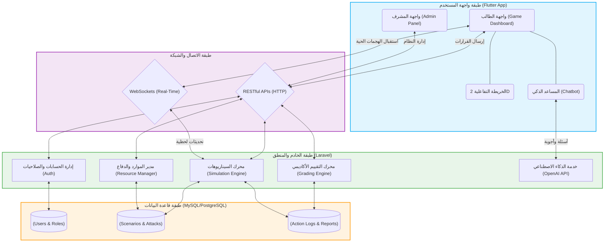
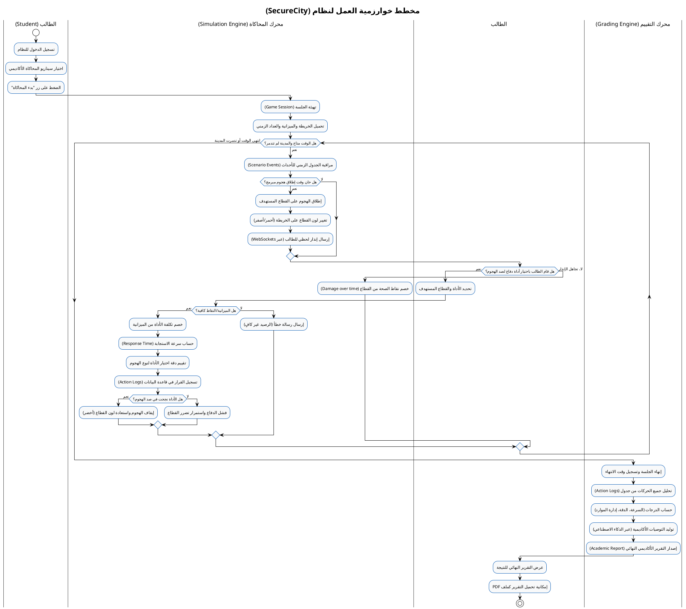
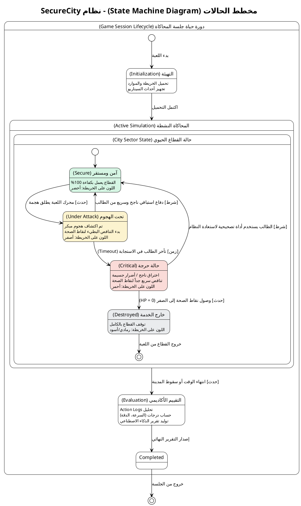
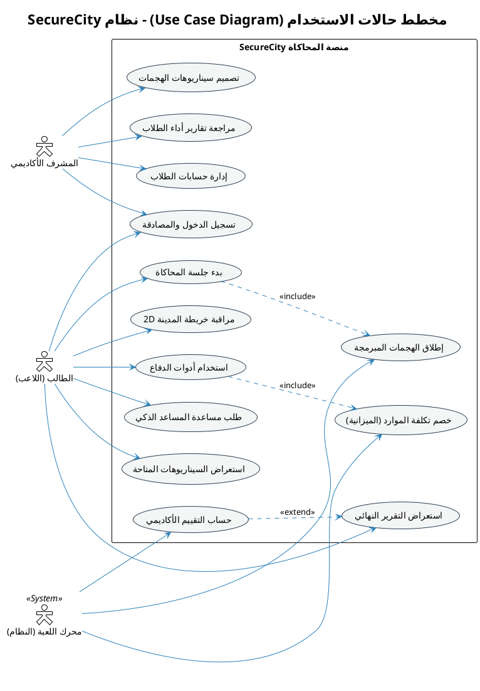

# taima-nawalGame
      

مشروع **SecureCity** هو فكرة ممتازة جداً لمشروع تخرج، كونه يدمج بين مفهوم "الألعاب الجادة" (Serious Games) والأمن السيبراني والتقييم الأكاديمي. 

بناءً على متطلباتك، **أوصي بشدة باستخدام Laravel (لارافيل) كخلفية (Back-end) بدلاً من Cloudflare Workers**. 
*السبب:* المشروع يعتمد على حفظ "جلسات اللعب" (Game Sessions)، تحليل البيانات المعقدة، إصدار تقارير أكاديمية، وإدارة علاقات معقدة في قاعدة البيانات (مثل المستخدمين، السيناريوهات، الموارد، سجل القرارات). لارافيل ممتاز ومصمم خصيصاً لهذه الأمور ويحتوي على مكتبات جاهزة لإصدار التقارير (PDF/Excel)، بينما Cloudflare Workers ممتاز للـ APIs البسيطة والسريعة جداً ولكنه سيكون معقداً ومكلفاً في بناء نظام تقييم وعلاقات قواعد بيانات معقدة.

إليك **خطة العمل الشاملة** لإنشاء المشروع من الصفر وحتى التسليم النهائي، مقسمة إلى مراحل منهجية:

---

### المرحلة الأولى: التحليل والتصميم المعماري (Architecture & ERD)
**المدة المقترحة: أسبوعان**
في هذه المرحلة يتم وضع حجر الأساس للمشروع.

1. **بناء مخطط قواعد البيانات (ERD):**
   * **جدول المستخدمين (Users):** اللاعبون (الطلاب/المتدربون) والمشرفون.
   * **جدول جلسات المحاكاة (Game Sessions):** لحفظ حالة اللعبة (وقت البدء، الانتهاء، النتيجة النهائية).
   * **جدول البنية التحتية (Infrastructures):** (المستشفيات، الكهرباء، الاتصالات، إلخ) مع تحديد "الحالة الصحية" لكل منها.
   * **جدول الهجمات (Attacks/Scenarios):** (DDoS، Ransomware، Data Leak) وتأثير كل هجمة.
   * **جدول أدوات الدفاع (Defenses/Resources):** (جدران حماية، نسخ احتياطي، عزل شبكة) مع تكلفة كل أداة (نقاط أو ميزانية افتراضية).
   * **جدول سجل الأحداث (Action Logs):** لتسجيل كل نقرة أو قرار يتخذه اللاعب مع الطابع الزمني (لحساب سرعة الاستجابة).
2. **تصميم واجهات المستخدم (UI/UX) عبر Figma:**
   * رسم خريطة المدينة الـ 2D التفاعلية.
   * تصميم لوحة تحكم اللاعب (Player Dashboard) التي تحتوي على الموارد، الإشعارات، وزر المساعد الذكي.
   * تصميم شاشة التقرير النهائي (التحليل الأكاديمي).

---

### المرحلة الثانية: برمجة الواجهة الخلفية (Back-end using Laravel)
**المدة المقترحة: 3 أسابيع**

1. **تجهيز بيئة العمل وقاعدة البيانات:** إنشاء الـ Migrations والـ Models بناءً على الـ ERD.
2. **برمجة واجهات برمجة التطبيقات (RESTful APIs):**
   * API لتسجيل الدخول وبدء جلسة محاكاة جديدة.
   * API لجلب حالة المدينة الحالية.
   * API لإرسال قرارات اللاعب (مثلاً: استخدام أداة دفاع x على القطاع y).
   * API لإنهاء اللعبة وتوليد التقرير.
3. **نظام الوقت الفعلي (Real-Time System):**
   * بما أنها لعبة تفاعلية، يجب استخدام تقنية مثل **Laravel Reverb** أو **Pusher** أو **WebSockets** لإرسال الهجمات فجأة للاعب وتغيير لون القطاعات (أخضر، أصفر، أحمر) بشكل حي دون الحاجة لتحديث الصفحة.
4. **نظام التقييم الأكاديمي:**
   * كتابة خوارزمية في لارافيل تحسب (النقاط النهائية) بناءً على: وقت الاستجابة + الموارد المتبقية + حجم الضرر الذي لحق بالمدينة.

---

### المرحلة الثالثة: برمجة واجهة المستخدم وتطوير اللعبة (Front-end using Flutter)
**المدة المقترحة: 4 أسابيع**
*(ملاحظة: أنصح بأن يكون التطبيق موجهاً لبيئة Web أو Desktop/Tablet لأن لوحات التحكم الأمنية تحتاج شاشات عريضة).*

1. **الأساسيات وإدارة الحالة (State Management):**
   * إنشاء مشروع فليتر وربطه بالـ APIs.
   * استخدام مدير حالة قوي مثل **Bloc/Cubit** أو **Riverpod** للتعامل مع التغيرات السريعة في اللعبة.
2. **تطوير الواجهة المرئية 2D التفاعلية:**
   * استخدام الـ Widgets المخصصة (CustomPaint) أو صور SVG تفاعلية لتمثيل المدينة.
   * ربط ألوان القطاعات (أخضر، أصفر، أحمر) بالبيانات القادمة من الباك-اند.
3. **برمجة واجهة تحكم اللاعب:**
   * قائمة الهجمات الجارية (Live Alerts).
   * قائمة أدوات الحماية المتاحة للاستخدام (Drag & Drop أو أزرار تفاعلية).
4. **دمج المساعد الذكي:**
   * تخصيص نافذة شات (Chatbot) داخل فليتر.
   * ربطها بـ OpenAI API (ChatGPT) بحيث يمكن للاعب سؤاله: "كيف أتعامل مع هجمة DDoS؟"، ويقوم المساعد بالرد كمستشار أمني.

---

### المرحلة الرابعة: ربط النظامين واختبار السيناريوهات (Integration & Logic)
**المدة المقترحة: أسبوعان**

1. **برمجة محرك السيناريوهات (Scenario Engine):**
   * جعل الباك-اند يطلق الأحداث برمجياً (مثال: في الدقيقة 1 من اللعبة تبدأ هجمة فدية على المستشفى).
2. **الربط المتزامن:**
   * التأكد من أن قرار اللاعب في فليتر يصل لـ Laravel، ويتم خصم الميزانية، وتحديث لون المستشفى إلى الأخضر مجدداً في نفس اللحظة.
3. **إصدار التقارير:**
   * برمجة شاشة النهاية في فليتر لعرض التقرير التحليلي الشامل.
   * يمكن استخدام مكتبة في لارافيل مثل `barryvdh/laravel-dompdf` لتصدير التقرير كملف PDF قابل للتحميل (لتقديمه للمشرف الأكاديمي).

---

### المرحلة الخامسة: الاختبار والتحسين (Testing & Optimization)
**المدة المقترحة: أسبوع**

1. **الاختبار الوظيفي (Functional Testing):** التأكد من أن جميع الأزرار، السيناريوهات، وعمليات تسجيل الدخول تعمل بلا أخطاء.
2. **اختبار تجربة المستخدم (Playtesting):** إعطاء التطبيق لزملاء آخرين لتجربة اللعبة. هل السيناريوهات صعبة جداً؟ هل التقييم عادل؟ هل ألوان الخريطة واضحة؟
3. **تحسين الأداء:** التأكد من عدم وجود بطء في فليتر عند كثرة التحريكات (Animations).

---

### المرحلة السادسة: التنفيذ النهائي والتوثيق (Deployment & Documentation)
**المدة المقترحة: أسبوع**

1. **الاستضافة (Deployment):**
   * رفع الـ Laravel Back-end وقاعدة البيانات على استضافة (مثل Hostinger أو DigitalOcean).
   * عمل Build لتطبيق الـ Flutter (سواء Web ورفعه على نفس الاستضافة، أو كملف تنفيذي Windows/Android).
2. **كتابة ملف التوثيق (Thesis/Report):**
   * كتابة ملف المشروع النهائي المطلوب للجامعة متضمناً (المقدمة، الـ ERD، المخططات UML، التقنيات المستخدمة، وواجهات النظام).
3. **التحضير للمناقشة (Presentation):**
   * تجهيز عرض تقديمي (PowerPoint).
   * تجهيز فيديو مسجل مدته دقيقتان يوضح "لعبة كاملة" كخطة احتياطية يوم المناقشة في حال ضعف الإنترنت.

**نصيحة تقنية لتميز المشروع أمام لجنة التحكيم:** 
في تقرير التقييم النهائي الذي يصدره النظام، اجعل النظام يعطي "نصائح مخصصة" بناءً على أخطاء اللاعب، مثلاً: *"لقد استغرقت 45 ثانية للرد على هجمة المستشفى مما أدى لتسريب بيانات، كان     

من الشبكات الفصل الثالث"*. هذا سيبهر لجنة التحكيم بالجانب الأكاديمي للمشروع.

ممتاز جداً. هذا التوجه سيجعل من المشروع **نظاماً أكاديمياً متكاملاً** (Academic Simulation System) وليس مجرد لعبة، وهو ما تبحث عنه لجان تحكيم مشاريع التخرج.

لقد قمت بتوسيع المخطط بالكامل ليطابق المعايير الأكاديمية والهندسية الدقيقة، مع تضمين التعديلات الخمسة التي طلبتها في جدول المستخدمين، وإضافة حقول متقدمة لباقي الجداول لتخدم غرض "التحليل والتقييم الأكاديمي الشامل".

إليك المخطط الأكاديمي الموسع (ERD Schema) متوافقاً مع قواعد بناء **Laravel Migrations**:

---

### 1. جدول المستخدمين (`users`)
تم تخصيصه بالكامل ليناسب البيئة الجامعية (طلاب ومشرفين).
* `id` (Primary Key - BigInt)
* `first_name` (String): الاسم الأول. *(تعديل رقم 1)*
* `last_name` (String): الكنية / الاسم الأخير. *(تعديل رقم 1)*
* `personal_id` (String - Unique): الرقم الشخصي أو الرقم الجامعي للطالب. *(تعديل رقم 3)*
* `gender` (Enum): الجنس (`male`, `female`). *(تعديل رقم 2)*
* `date_of_birth` (Date): تاريخ الميلاد. *(تعديل رقم 4)*
* `specialization` (String): التخصص (مثل: هندسة برمجيات، أمن سيبراني، نظم معلومات). *(تعديل رقم 5)*
* `academic_level` (String/Integer): المستوى أو السنة الدراسية (مثل: السنة الرابعة، السنة الخامسة). *(تعديل رقم 5)*
* `email` (String - Unique): البريد الإلكتروني الجامعي أو الشخصي.
* `password` (String): كلمة المرور (مُشفرة).
* `role` (Enum): الدور في النظام (`student` طالب، `instructor` دكتور/مشرف، `admin` مدير).
* `is_active` (Boolean): حالة الحساب (نشط/موقوف).
* `timestamps`: (تاريخ إنشاء الحساب وتحديثه).
* `softDeletes`: (للاحتفاظ ببيانات الطالب حتى لو تم حذف حسابه ظاهرياً).

---

### 2. جدول السيناريوهات التعليمية (`academic_scenarios`)
البيئة التي يصممها الدكتور لاختبار الطلاب.
* `id` (Primary Key)
* `instructor_id` (Foreign Key): يربط بالدكتور الذي أنشأ السيناريو.
* `title` (String): عنوان السيناريو (مثال: "اختبار اختراق البنية التحتية الصحية").
* `learning_objectives` (Text): **(أكاديمي)** الأهداف التعليمية من هذا السيناريو (ماذا سيتعلم الطالب؟).
* `difficulty_level` (Enum): مستوى الصعوبة (`Beginner`, `Intermediate`, `Advanced`).
* `max_duration_minutes` (Integer): الحد الأقصى للوقت المسموح لإنهاء المحاكاة.
* `starting_budget` (Integer): الميزانية/الموارد المتاحة للطالب في البداية.
* `passing_score_threshold` (Integer): **(أكاديمي)** درجة النجاح المطلوبة لاجتياز السيناريو (مثلاً 60 من 100).
* `is_published` (Boolean): هل السيناريو متاح للطلاب أم قيد الإعداد؟

---

### 3. جدول المكتبة الأكاديمية للهجمات (`attack_types`)
يمثل الهجمات كمعلومات علمية وليس مجرد أعداء في اللعبة.
* `id` (Primary Key)
* `name` (String): اسم الهجمة (مثال: DDoS, SQL Injection, Ransomware).
* `mitre_tactics` (String): **(أكاديمي)** تصنيف الهجوم حسب إطار العمل العالمي MITRE ATT&CK (يفيد جداً في التوثيق).
* `scientific_description` (Text): شرح علمي لكيفية عمل الهجمة برمجياً وشبكياً.
* `severity_level` (Enum): مستوى الخطورة.
* `damage_rate_per_second` (Float): معدل تدمير البنية التحتية في الثانية.

---

### 4. جدول أدوات الحماية والموارد (`defense_tools`)
* `id` (Primary Key)
* `name` (String): اسم الأداة (مثال: تفعيل IPS/IDS، عزل الخادم، تفعيل النسخ الاحتياطي).
* `category` (Enum): نوع الأداة (`Preventive` وقائي، `Detective` كاشف، `Corrective` تصحيحي).
* `cost_points` (Integer): تكلفة استخدام الأداة.
* `deployment_time_seconds` (Integer): **(أكاديمي/واقعي)** الوقت الذي تستغرقه الأداة لتعمل (في الواقع، عزل الشبكة يأخذ وقتاً، مما يفرض على الطالب التفكير الاستباقي).
* `success_probability` (Float): نسبة نجاح الأداة (مثلاً 0.8 تعني 80%، حيث لا يوجد حل أمني مضمون 100%).

---

### 5. جدول البنية التحتية للمدينة الذكية (`city_sectors`)
* `id` (Primary Key)
* `name` (String): اسم القطاع (مستشفى، محطة كهرباء...).
* `criticality_score` (Integer): أهمية القطاع من 1 إلى 10.
* `dependency_sector_id` (Foreign Key - Nullable): **(أكاديمي جداً)** قطاع يعتمد عليه هذا القطاع. (مثال: قطاع "المستشفى" يعتمد على قطاع "الكهرباء"، إذا سقطت الكهرباء، يتضرر المستشفى تلقائياً. هذا يختبر ذكاء الطالب في تحديد الأولويات!).

---

### 6. جدول الجدولة الزمنية للأحداث (`scenario_events`)
محرك اللعبة الخلفي الذي يحدد متى تقع الكارثة.
* `id` (Primary Key)
* `scenario_id` (Foreign Key): السيناريو المرتبط.
* `attack_type_id` (Foreign Key): نوع الهجوم المبرمج.
* `target_sector_id` (Foreign Key): القطاع المستهدف.
* `trigger_time_seconds` (Integer): متى تبدأ الهجمة؟ (مثال: في الثانية 120 من بدء الامتحان).
* `is_hidden` (Boolean): هل الهجمة ظاهرة على الرادار أم هجمة خفية (Zero-day) تتطلب من الطالب الانتباه للمؤشرات؟

---

### 7. جدول جلسات الامتحان/المحاكاة (`game_sessions`)
سجل محاولات الطالب الفعلي.
* `id` (Primary Key)
* `student_id` (Foreign Key): الطالب الذي أجرى المحاكاة.
* `scenario_id` (Foreign Key): السيناريو المُلعب.
* `start_time` (DateTime): وقت بدء المحاكاة.
* `end_time` (DateTime): وقت انتهاء المحاكاة.
* `termination_reason` (Enum): سبب الانتهاء (`Completed` أكمل بنجاح، `Time_Out` انتهى الوقت، `City_Destroyed` تدمرت المدينة وفشل).
* `instructor_notes` (Text): ملاحظات يكتبها الدكتور يدوياً بعد مراجعة أداء الطالب.

---

### 8. جدول التتبع الدقيق (Action Logs & Telemetry) (`action_logs`)
**هذا الجدول هو قلب التقييم الأكاديمي**، فهو يعادل "الصندوق الأسود" للطالب.
* `id` (Primary Key)
* `session_id` (Foreign Key): الجلسة.
* `event_id` (Foreign Key - Nullable): الهجوم الذي تفاعل معه الطالب.
* `defense_tool_id` (Foreign Key): الأداة التي استخدمها.
* `action_timestamp` (DateTime): الطابع الزمني الدقيق للقرار.
* `time_to_respond_seconds` (Float): كم ثانية استغرق الطالب لاتخاذ القرار منذ ظهور الإنذار؟
* `effectiveness_percentage` (Float): إلى أي مدى كان قراره صحيحاً في صد هذا الهجوم بالذات (من 0 إلى 100%).

---

### 9. جدول التقارير الأكاديمية المفصلة (`academic_reports`)
يُبنى هذا الجدول تلقائياً بواسطة خوارزمية (في لارافيل) عند انتهاء الجلسة.
* `id` (Primary Key)
* `session_id` (Foreign Key): الجلسة.
* `speed_score` (Float): درجة سرعة الاستجابة (مثلاً 20/25).
* `accuracy_score` (Float): درجة دقة اختيار الأدوات المناسبة (مثلاً 40/50).
* `resource_management_score` (Float): درجة إدارة الميزانية والموارد (مثلاً 20/25).
* `total_score` (Float): المجموع النهائي (مثلاً 80/100).
* `grade_classification` (Enum): التقدير (`A`, `B`, `C`, `F`).
* `system_recommendations` (Text): **(دمج الذكاء الاصطناعي)** نصائح تُولد آلياً (مثال: "الطالب بطيء جداً في معالجة هجمات الفدية، ويستهلك ميزانية عالية في أدوات غير فعالة. يُنصح بمراجعة الفصل الرابع").

---

### 💡 لماذا هذا المخطط يعتبر "أكاديمياً بامتياز" لتقديم مشروع التخرج؟
1. **الاعتمادية (Dependencies):** إضافة فكرة "اعتماد القطاعات على بعضها" (الجدول 5) يرفع مستوى المشروع من لعبة بسيطة إلى محاكاة (Simulation) حقيقية للبنية التحتية.
2. **التقييم المتعدد الأبعاد (Multi-dimensional Grading):** الطالب لا يُقيّم بنتيجة واحدة فقط (نجح/رسب)، بل يُقيّم بناءً على (السرعة، الدقة، إدارة الموارد) كما في الجدول 9، وهو أسلوب تقييم جامعي قياسي (Rubric).
3. **التوثيق العلمي:** ربط الهجمات بـ `mitre_tactics` والأهداف التعليمية `learning_objectives` يثبت للجنة التحكيم أن الطالبات بحثن في العمق العلمي للأمن السيبراني ولم     يقمن ببرمجة الواجهات فقط.   

المخطط الصندوقي (Block Diagram) أو ما يُعرف بـ **مخطط معمارية النظام (System Architecture Diagram)** هو جزء أساسي جداً في توثيق مشاريع التخرج الهندسية، حيث يوضح للجنة التحكيم كيف تتواصل أجزاء النظام (تطبيق فليتر، خادم لارافيل، قاعدة البيانات، والذكاء الاصطناعي) مع بعضها البعض.

لقد قمت بإعداد المخطط الصندوقي باستخدام لغة **Mermaid** (وهي لغة معتمدة عالمياً لرسم المخططات برمجياً). 

### أولاً: شرح مكونات المخطط الصندوقي (لإضافتها في التوثيق)
النظام مقسم إلى 4 طبقات رئيسية (Layers):
1. **طبقة العرض (Presentation Layer - Flutter):** تحتوي على واجهات الطالب (الخريطة 2D، أدوات الدفاع، المساعد الذكي) وواجهات المشرف (إنشاء السيناريوهات، عرض التقارير).
2. **طبقة الاتصال (Communication Layer):** وهي الوسيط، وتتكون من (REST APIs) للبيانات العادية، و (WebSockets) لنقل الهجمات وتغيير ألوان الخريطة في الوقت الفعلي (Real-time).
3. **طبقة المنطق والخادم (Application Layer - Laravel):** هي "عقل" النظام، وتحتوي على محرك المحاكاة، محرك التقييم الأكاديمي، ونظام إدارة الموارد، بالإضافة إلى خدمة الربط مع (OpenAI) للمساعد الذكي.
4. **طبقة البيانات (Data Layer):** قاعدة البيانات (MySQL/PostgreSQL) التي تحتوي على الجداول التي صممناها سابقاً.

---

### ثانياً: كود المخطط الصندوقي (Mermaid Code)
يمكنك نسخ هذا الكود ولصقه في موقع **[Mermaid Live Editor](https://mermaid.live)** وسيتم رسم المخطط الصندوقي فوراً بشكل هندسي احترافي جاهز للتحميل كصورة (PNG) لإرفاقه في مشروعك:

---

### طريقة تحويل الكود إلى صورة:
1. اذهب إلى الموقع: **[mermaid.live](https://mermaid.live)**
2. في القسم الأيسر (Code)، قم بمسح الكود الموجود والصق الكود الموجود في الأعلى.
3. سيظهر لك المخطط الصندوقي مقسماً إلى 4 مربعات كبيرة (مظللة بألوان مريحة للعين تمثل الطبقات)، وبداخلها المكونات الفرعية والأسهم التي توضح اتجاه تدفق البيانات (Data Flow).
4. من الأسفل، اضغط على زر **Save** أو **Download PNG** لحفظ المخطط بجودة عالية جداً. 

هذا المخطط يبرز لأساتذة المناقشة فهمكم العميق لمعمارية النظم الموزعة (Client-Server Architecture) والفصل المنطقي بين الواجهات والعمليات الخلفية وقواعد البيانات.

مخطط خوارزمية العمل (Algorithm Flowchart) هو من أهم المخططات في مشاريع التخرج، لأنه يوضح **التسلسل المنطقي للعمليات (Logic Flow)** منذ بداية اللعبة وحتى صدور التقييم النهائي، ويشرح كيف يتفاعل المستخدم مع النظام.

لجعل المخطط احترافياً وأكاديمياً، استخدمت هنا تقنية **(Swimlanes - مسارات السباحة)** في PlantUML، والتي تقسم المخطط إلى أعمدة توضح "من يفعل ماذا؟" (الطالب، محرك المحاكاة، ومحرك التقييم).

### كود مخطط الخوارزمية (PlantUML Activity Diagram):

قم بنسخ هذا الكود ولصقه في موقع **[PlantText](https://www.planttext.com/)** أو **[PlantUML](https://www.plantuml.com/plantuml/uml/)**:

### 💡 شرح تفاصيل المخطط للجنة المناقشة:
عندما تضعين هذا المخطط في توثيق المشروع (ملف الوورد/الـ PDF)، يمكنك كتابة الشرح التالي أسفله لتعزيز القوة الأكاديمية:

1. **التقسيم إلى مسارات (Swimlanes):** تم تقسيم الخوارزمية إلى 3 أعمدة (الطالب، محرك المحاكاة، محرك التقييم) ليوضح الفصل المنطقي (Separation of Concerns) في هندسة البرمجيات.
2. **الحلقة التكرارية (While Loop):** تُمثل هذه الحلقة **"قلب اللعبة" (Game Loop)**، حيث يستمر الخادم في التحقق من حالة المدينة وإرسال الهجمات طوال مدة المحاكاة.
3. **تتبع الأداء (Tracking):** المخطط يوضح النقطة الحرجة في المشروع، وهي اللحظة التي يتخذ فيها الطالب قراراً، وكيف يقوم النظام فوراً بـ (حساب سرعة الاستجابة، خصم التكلفة، و      تقييم الدقة) قبل تسجيلها في قاعدة البيانات لاستخدامها لاحقاً في التقييم النهائي.

مخطط الحالات (State Machine Diagram) هو أحد أهم مخططات UML السلوكية، وهو يركز على **دورة حياة كائن معين (Lifecycle)** وكيف تتغير حالته بناءً على الأحداث (Events) والشروط (Guard Conditions).

بناءً على فكرة مشروعك (تغير ألوان الخريطة ديناميكياً: أخضر، أصفر، أحمر)، فإن هذا المخطط هو الأنسب لشرح **كيف تتغير حالة القطاع الحيوي (مثل المستشفى أو شبكة الكهرباء) أثناء اللعب**، وكيف تتغير حالة "جلسة المحاكاة" ككل.

لقد صممت لك المخطط باستخدام **PlantUML** مع دمج الحالات المتداخلة (Nested States) لإظهار احترافية عالية أمام لجنة المناقشة.

### كود مخطط الحالات (PlantUML State Diagram):

قم بنسخ الكود التالي ولصقه في موقع **[PlantText](https://www.planttext.com/)** أو **[PlantUML](https://www.plantuml.com/plantuml/uml/)**:

### 💡 شرح هندسي للمخطط (لإضافته في ملف توثيق المشروع):
عند تقديم هذا المخطط للجنة التحكيم، يمكنك الشرح بالنقاط التالية لإبراز قوتكم الأكاديمية:

1. **الحالات المتداخلة (Composite States):** المخطط يوضح حالة النظام العامة (جلسة المحاكاة) وبداخلها حالة فرعية وهي (حالة القطاع الحيوي)، مما يثبت قدرتكم على تحليل الأنظمة المعقدة.
2. **ارتباط المخطط بفكرة المشروع:** يترجم المخطط ما تم ذكره في فكرة المشروع الأصلية بشكل هندسي، حيث يتنقل القطاع من الحالة الآمنة **(أخضر Green)** إلى التحذير **(أصفر Yellow)** وإذا تأخر الطالب في اتخاذ القرار يتحول للحالة الحرجة **(أحمر Red)**.
3. **الشروط والأحداث (Transitions & Guards):** الأسهم المكتوبة بالمخطط ليست عشوائية، بل تحتوي على:
   * **[حدث Event]:** مثل "محرك اللعبة يطلق هجمة"، وهو ما ينقل القطاع من حالة لأخرى دون تدخل الطالب.
   * **[شرط Guard Condition]:** مثل "دفاع استباقي ناجح وسريع"، وهو القرار الذي يتخذه الطالب لإرجاع حالة النظام إلى اللون الأخضر الآمن.
   * **[زمن Time Trigger]:** وهو عامل الوقت، فالتأخير ينقل النظام تلقائياً للانهيار، مما يبرز أهمية "سرعة الاستجابة" التي سيتم تقييم الطالب عليها لاحقاً.

مصطلح "مخطط UML" يشمل عدة أنواع من المخططات (مثل Use Case, Sequence, Class). ولكن في مشاريع التخرج، عندما يُطلب "مخطط UML" بشكل عام كجزء أساسي من التوثيق، فإن المقصود به غالباً هو **مخطط حالات الاستخدام (Use Case Diagram)**.

هذا المخطط مهم جداً لأنه يوضح **"من يفعل ماذا؟"** داخل النظام، ويحدد الممثلين (Actors) مثل (الطالب، المشرف، ومحرك النظام) والصلاحيات والوظائف المتاحة لكل منهم بشكل رسومي مبسط ومفهوم.

لقد قمت بكتابة الكود الخاص به باستخدام **PlantUML** مع إضافة العلاقات الأكاديمية الهامة مثل (`<<include>>` و `<<extend>>`) التي تبحث عنها لجان التحكيم.

### كود مخطط حالات الاستخدام (PlantUML Use Case Diagram):

قم بنسخ هذا الكود ولصقه في موقع **[PlantText](https://www.planttext.com/)** أو **[PlantUML](https://www.plantuml.com/plantuml/uml/)**:

### 💡 شرح التفاصيل الأكاديمية للمخطط (لإضافته في ملف الوورد/التوثيق):

عند إضافة هذا المخطط إلى ملف المشروع، يمكنك كتابة هذا الشرح تحته لإظهار الاحترافية:

1. **الممثلون (Actors):** تم تحديد 3 أطراف رئيسية تتفاعل مع النظام:
   * **الطالب:** هو المستخدم الأساسي الذي يتفاعل مع واجهة اللعبة (Flutter).
   * **المشرف الأكاديمي:** يمتلك صلاحيات إدارة المحتوى (إضافة طلاب وسيناريوهات).
   * **محرك اللعبة (System Actor):** تم اعتباره كممثل (Actor) لأنه يقوم بوظائف تلقائية في الخلفية (Laravel) دون تدخل بشري، مثل إطلاق الهجمات في وقتها المحدد وحساب التقييم.

2. **العلاقات المتقدمة (Relationships):**
   * **علاقة التضمين `<<include>>`:** تم استخدامها لتوضيح أن "استخدام أداة الدفاع" يتضمن بالضرورة "خصم الميزانية" من اللاعب، وبدء اللعبة يتضمن تشغيل الهجمات.
   * **علاقة التوسيع `<<extend>>`:** تم استخدامها لتوضيح أن "حساب التقييم" يمكن أن يؤدي إلى "عرض التقرير النهائي" في نهاية الجلسة.

*(ملاحظة: إذا كان قصدك من "مخطط UML" نوعاً آخر مثل مخطط الأصناف Class Diagram أو مخطط التتابع Sequence Diagram الذي يشرح كيف تتخاطب الـ APIs، أخبرني وسأقوم بكتابة الكود الخاص به فوراً بنفس الجودة الأكاديمية).*

